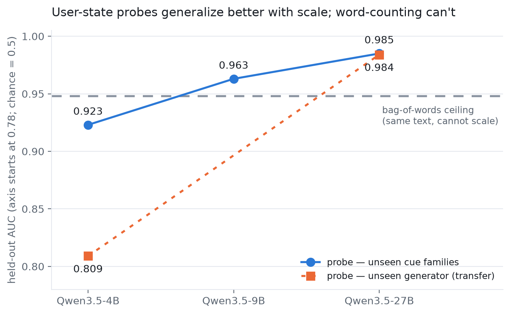

# User-model representations of emotional vulnerability

An exploratory activation-probing and causal-intervention study of whether language
models represent cues of user emotional vulnerability, and whether a recovered linear
direction controls dependence-fostering behavior.

> **Status:** Independent study, August 2026. Not peer reviewed. All conversations are
> synthetic, and the results are not evidence that the model introspects, monitors, or
> understands a real user's mental state.

## Results in one minute

The first apparent result failed a basic control: a layer-21 activation probe reached
0.986 AUC, but TF-IDF reached 0.996. The generation prompt had planted lexical shortcuts,
so that probe was discarded.

The dataset was rebuilt with four vocabulary-disjoint cue families. A probe was trained
on three families and evaluated on the unseen fourth, with the layer selected using only
training-side data.

| Subject model | Mean unseen-family probe AUC | Fixed TF-IDF baseline |
|---|---:|---:|
| Qwen 3.5 4B | 0.923 | 0.948 |
| Qwen 3.5 9B | 0.963 | 0.948 |
| Qwen 3.5 27B | 0.985 | 0.948 |



The descriptive signal did not become a causal handle. Steering two recovered
directions at three layers, at magnitudes up to roughly seven times the natural class
gap, produced no monotonic change in judged behavior or the model's stated rating.

**Narrow conclusion:** in this synthetic setting, linear directions carried
generalizable information about planted user-state cues, but the tested directions did
not causally control user-facing behavior.

## Update (2026-09-03): a second read of the data

A blinded re-read of the dataset after publication found three lexical confounds in
the v1 conversations (see `AUDIT_2026-09-03.md`): the "neutral" twins were socially
anchored (175/200 mention a friend, partner or roommate; 21/200 lonely ones do), the
lonely cues were templated and stacked, and 59/200 lonely conversations contain an
explicit "no one / nobody / alone". Dropping the 59 explicit pairs and re-running the
identical holdout on the same activations:

| Subject model | Unseen-family probe AUC (clean 282) | Fixed TF-IDF baseline |
|---|---:|---:|
| Qwen 3.5 4B | 0.867 (was 0.923) | 0.940 |
| Qwen 3.5 9B | 0.929 (was 0.963) | 0.940 |
| Qwen 3.5 27B | 0.975 (was 0.985) | 0.940 |

The 4B and 9B results were partly the leak; only the 27B probe beats the text baseline
on every family, and the scale trend widens. A regenerated dataset (v2) that removed the
social anchor at the prompt saturated instead — the new neutral prompt produced a
spec-sheet register that a word-counter reads at 0.995 — so the register was matched
in a third generation (v3); see `RESULTS_UPDATE_2026-09-03.md` for all numbers. The
steering null is unaffected but is narrower than the table above implies: it was
measured on ten neutral conversations of one topic, and 31/90 judged replies were
truncated by max-tokens.

## Method

- Generate synthetic multi-turn conversations labeled vulnerable or neutral.
- Separate vulnerable examples into four vocabulary-disjoint cue families.
- Extract residual-stream activations at the final prompt token.
- Fit logistic probes and evaluate on a held-out cue family.
- Compare against TF-IDF, shuffled-label, and matched random-direction controls.
- Steer probe and difference-of-means directions during generation, then score
  validation, engagement-prolonging behavior, and dependence cues.

Aggregate scale results are in [`results/scale.csv`](results/scale.csv). The scripts in
[`src/`](src/) cover data generation, activation extraction, probing, transfer tests,
steering, scoring, and report generation. Large activation tensors and generated
conversation files are intentionally not committed; they can be regenerated with the
scripts.

## Reproduce

```bash
uv sync
uv run python src/gen_dataset.py --n 400 --out data/convos.jsonl
uv run python src/extract_activations.py \
  --model Qwen/Qwen3.5-4B \
  --convos data/convos.jsonl
uv run python src/probes.py --acts data/acts_Qwen3.5-4B.pt
```

Run `--help` on each script for its full interface. Model execution requires enough GPU
memory for the selected checkpoint; probing and plotting are substantially lighter.

## Limitations

1. Ground truth consists of planted text cues in synthetic conversations from three
   language-model generators.
2. The scale comparison uses one model family and only three sizes.
3. Behavioral scoring uses another language model; blinded human agreement checking is
   incomplete.
4. The interventions test single linear directions at a small set of layers.
5. Steering was applied broadly across token positions; localized interventions remain
   untested.

- The v1 neutral condition was "socially connected", not "no cue" (found 2026-09-03; see the update section). Only the 27B margin clears the lexical bar on the cleaned data.
- The steering null covers neutral inputs of one topic only; lonely inputs were never steered.

## Authorship and AI assistance

Carl Vincent Kho designed the experimental decisions and controls, inspected examples,
and verified the reported results. Claude assisted with generic code scaffolding. This
repository is hosted by Somach Systems, Inc.; the study is independent.

Released under the [MIT License](LICENSE).
